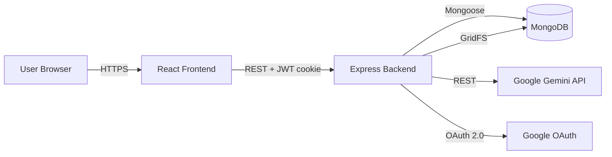
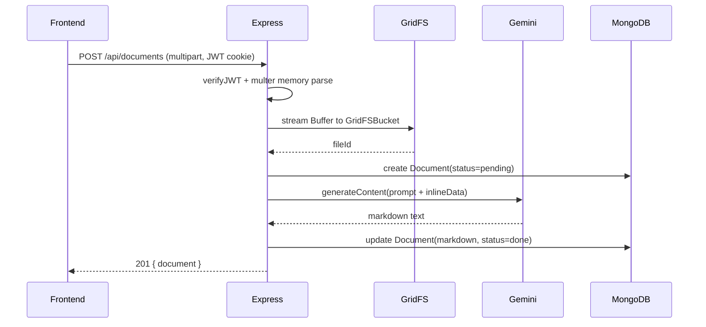
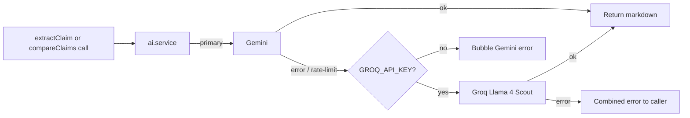

# ClaimScribe - AI Medical Claim Document Extractor

A full-stack web application that turns scanned medical insurance claim
documents (PDFs or photos) into clean, structured Markdown using Google
Gemini. Authenticated users can upload, browse history, and run
AI-powered side-by-side comparisons across multiple claims.

This project started as a single-page React prototype and was rebuilt as
a proper full-stack MVC platform: a Node/Express/MongoDB backend that
owns all secrets and AI calls, and a refreshed React frontend with
routing, authentication, and animations.

---

## Architecture



**Why the rewrite mattered**

| Problem in v1 (single-page prototype)   | Solution in v2 (this repo)                          |
|-----------------------------------------|------------------------------------------------------|
| Gemini API key shipped to the browser   | Key lives only in backend env, never sent to client  |
| Heavy PDF rendering on the client       | Gemini natively accepts PDFs - no pdfjs-dist needed  |
| No persistence - results lost on reload | MongoDB + GridFS stores history per user             |
| No accounts, no privacy boundary        | JWT-cookie auth (email/password and Google OAuth)    |
| One 412-line monolith                   | Layered backend, page-per-route frontend             |

Backend uses an **MVC + service layer** pattern:

- **Routes**: declare HTTP shape and validation (Zod).
- **Controllers**: thin - parse `req`, call a service, return `ApiResponse`.
- **Services**: business logic, no Express objects. Reusable from any caller.
- **Models**: Mongoose schemas (`User`, `Document`, `Comparison`).
- **Config**: env validation, DB + GridFS, Passport strategies, Gemini client.
- **Middleware**: JWT verification, multer upload, central error handler.

---

## Features

- Email + password signup/login with bcrypt-hashed credentials
- Google OAuth sign-in (auto-links to existing email accounts)
- Drag-and-drop upload (PDF or image, up to 10 MB)
- AI extraction into structured Markdown (claim info, patient, hospital,
  diagnosis, billing table, summary)
- Provider fallback: Gemini (primary) auto-falls-back to Groq's
  Llama 4 Scout (multimodal) on failure or rate-limit, when `GROQ_API_KEY`
  is configured
- Per-user upload history persisted in MongoDB
- Original file storage via GridFS (re-downloadable any time)
- AI multi-document comparison: pick 2-5 past claims, get a markdown
  report with similarities, differences, anomalies, and a recommendation
- Animated UI with framer-motion: page transitions, staggered card lists,
  skeleton loaders, toast notifications
- Hardened backend: helmet, CORS allow-list, rate limiting on auth and
  upload routes, Zod validation, central error envelope
- Graceful shutdown, env validation that fails fast on misconfig

---

## Tech Stack

### Frontend

| Tech              | Why                                                              |
|-------------------|------------------------------------------------------------------|
| React 19 + Vite   | Fast dev server, HMR, native ES modules                          |
| React Router 7    | SPA routing with nested routes and guards                        |
| Axios             | Cookie-based auth via `withCredentials`, interceptors            |
| Framer Motion     | Declarative page transitions and component animations            |
| React Dropzone    | Battle-tested drag-and-drop file uploads                         |
| React Markdown + remark-gfm | Renders extraction output incl. GFM tables             |
| react-hot-toast   | Non-blocking notifications (replaces `alert()`)                  |

### Backend

| Tech              | Why                                                              |
|-------------------|------------------------------------------------------------------|
| Node.js + Express | Mature, batteries-included HTTP framework                        |
| MongoDB + Mongoose| Flexible schema for evolving document/comparison data            |
| GridFS            | Streams large files in chunks, no separate object store needed   |
| JWT in httpOnly cookie | XSS-resistant session token; sameSite=strict deters CSRF    |
| Passport (Google) | Standard OAuth handshake; session disabled, JWT-only             |
| bcryptjs          | Industry-standard password hashing                               |
| Multer (memory)   | Parses multipart bodies straight into a Buffer for GridFS        |
| Zod               | Validation for env, request body, params, query                  |
| Helmet, CORS, rate-limit | Standard hardening primitives                             |
| @google/generative-ai | Official Gemini SDK; supports multimodal `inlineData` parts |
| Groq (Llama 4 Scout) | Optional fallback provider; OpenAI-compatible API, multimodal text+image |
| pdfjs-dist + @napi-rs/canvas | Server-side PDF rasterization for the Groq fallback (Groq has no native PDF support) |

### Infra (local + deploy)

| Tech              | Why                                                              |
|-------------------|------------------------------------------------------------------|
| MongoDB Atlas (or local Mongo) | Hosted DB with free tier; works locally too        |
| Vercel / Netlify  | Static SPA hosting for the frontend                              |
| Render / Railway / Fly | Container hosting for the Express backend                   |

---

## Folder Structure

```
file-to-text-extractor/
├── backend/
│   ├── src/
│   │   ├── config/         env, db (+GridFS), passport, gemini
│   │   ├── controllers/    thin HTTP wrappers
│   │   ├── middleware/     auth, upload, validate, error
│   │   ├── models/         User, Document, Comparison
│   │   ├── prompts/        extractClaim, compareClaims
│   │   ├── routes/         /auth, /documents, /comparisons
│   │   ├── services/       auth, storage, gemini, groq, ai, document, pdfRasterize
│   │   ├── utils/          ApiError, ApiResponse, asyncHandler
│   │   ├── app.js          Express composition
│   │   └── server.js       process entry point
│   ├── .env.example
│   └── package.json
├── frontend/
│   ├── src/
│   │   ├── api/            client + per-domain API wrappers
│   │   ├── components/
│   │   │   ├── auth/       ProtectedRoute
│   │   │   ├── documents/  Dropzone, DocumentCard/List, MarkdownViewer
│   │   │   ├── layout/     Navbar, PageTransition
│   │   │   └── ui/         Button, Spinner, ProgressBar, Skeleton
│   │   ├── context/        AuthContext + useAuth
│   │   ├── hooks/          useDocuments
│   │   ├── pages/          Login, Signup, Dashboard, DocumentDetail, Compare, NotFound
│   │   ├── routes/         AppRoutes (with AnimatePresence)
│   │   ├── styles/         globals.css, animations.css
│   │   ├── utils/          format, download
│   │   ├── App.jsx
│   │   └── main.jsx
│   ├── .env.example
│   └── package.json
└── README.md
```

---

## Request Flow Walkthrough

### Upload + extraction



### Authentication (email + password)

1. `POST /api/auth/signup` validates body, bcrypt-hashes password, creates `User`.
2. Backend signs a JWT with `sub = user._id` and sets it as an
   `httpOnly`, `sameSite=strict`, `secure` (in prod) cookie named `token`.
3. Frontend's axios client always sends that cookie via `withCredentials`.
4. `verifyJWT` middleware reads the cookie, verifies it, and re-fetches
   the user from MongoDB on every request - so banned/deleted users are
   locked out immediately.

### Authentication (Google OAuth)

1. Frontend links to `/api/auth/google` (a full-page nav, not XHR).
2. Passport redirects to Google's consent screen.
3. Google calls back to `/api/auth/google/callback` with the profile.
4. `findOrCreateGoogleUser` upserts the user (linking by email if a
   password user already exists).
5. Same JWT cookie is set, browser is redirected back to the SPA.

### AI provider fallback



All AI calls flow through [`backend/src/services/ai.service.js`](backend/src/services/ai.service.js).
Gemini is always primary. If `GROQ_API_KEY` is set and Gemini throws,
the same call is retried against Groq's Llama 4 Scout (multimodal)
using its OpenAI-compatible chat-completions endpoint.

Limits worth knowing:

- **Groq has no native PDF support**, so when the fallback handles a
  PDF, [`backend/src/services/pdfRasterize.service.js`](backend/src/services/pdfRasterize.service.js)
  renders each page to a JPEG (using `pdfjs-dist` + `@napi-rs/canvas`)
  and sends the images instead. This only runs in the fallback path -
  Gemini always gets the original PDF directly.
- **Page cap on PDFs through the fallback: 5 pages.** Groq accepts at
  most 5 image parts per message. If the PDF has more pages, only the
  first 5 are rendered and a notice is appended to the prompt so the
  model surfaces the truncation in the extracted markdown.
- **Per-image cap: ~4 MB.** Direct image uploads above this cap error
  out from the fallback. Rasterized PDF pages typically come in well
  under at scale 2.0 / JPEG 0.85.
- The fallback fires for *any* Gemini error - we don't try to classify
  retryable vs not. Worst case we waste one extra call; best case the
  request succeeds.

---

## Local Setup

### Prerequisites

- Node.js 18+
- MongoDB running locally OR a MongoDB Atlas connection string
- A [Google Gemini API key](https://aistudio.google.com/app/apikey)
- (Optional) A [Groq API key](https://console.groq.com/keys) as a fallback
  provider when Gemini fails or hits rate limits
- (Optional) Google OAuth credentials from
  [Google Cloud Console](https://console.cloud.google.com/apis/credentials)

### 1. Clone

```bash
git clone <your-fork-url>
cd file-to-text-extractor
```

### 2. Backend

```bash
cd backend
cp .env.example .env
# edit .env, fill MONGO_URI, JWT_SECRET, GEMINI_API_KEY, (optionally Google OAuth)
npm install
npm run dev
# -> "API listening on http://localhost:5000 (development)"
```

> Make sure `PORT=5000` so the frontend's Vite dev proxy (which targets
> `http://localhost:5000/api`) can reach the API. If you change it, also
> update `frontend/vite.config.js`.

### 3. Frontend (in a new terminal)

```bash
cd frontend
cp .env.example .env
# default VITE_API_URL=/api works because of vite's dev proxy
npm install
npm run dev
# -> "Local: http://localhost:5173"
```

Open `http://localhost:5173`, sign up, drop a claim PDF/image, watch the
markdown appear.

---

## API Reference

All `/api/documents/*` and `/api/comparisons/*` routes require an
authenticated session (the `token` cookie set by login/signup).

| Method | Path                              | Auth | Body / Query                                      | Description                                |
|--------|-----------------------------------|------|---------------------------------------------------|--------------------------------------------|
| GET    | `/api/health`                     | -    | -                                                 | Liveness probe                             |
| POST   | `/api/auth/signup`                | -    | `{ email, password, name? }`                      | Create account, sets cookie                |
| POST   | `/api/auth/login`                 | -    | `{ email, password }`                             | Log in, sets cookie                        |
| POST   | `/api/auth/logout`                | -    | -                                                 | Clears cookie                              |
| GET    | `/api/auth/me`                    | yes  | -                                                 | Current user                               |
| GET    | `/api/auth/google`                | -    | -                                                 | Start Google OAuth (full-page redirect)    |
| GET    | `/api/auth/google/callback`       | -    | (handled by Google)                               | OAuth callback, sets cookie, redirects FE  |
| GET    | `/api/documents`                  | yes  | -                                                 | List my documents (newest first)           |
| POST   | `/api/documents`                  | yes  | `multipart/form-data` field `file`                | Upload + extract                           |
| GET    | `/api/documents/:id`              | yes  | -                                                 | Get one (with markdown)                    |
| DELETE | `/api/documents/:id`              | yes  | -                                                 | Delete document + GridFS file              |
| GET    | `/api/documents/:id/file`         | yes  | -                                                 | Stream original file back                  |
| GET    | `/api/comparisons`                | yes  | -                                                 | List my comparisons                        |
| POST   | `/api/comparisons`                | yes  | `{ documentIds: string[] }` (2-5)                 | Run AI comparison                          |
| GET    | `/api/comparisons/:id`            | yes  | -                                                 | Get one                                    |

All responses use the envelope:

```json
{ "success": true, "message": "...", "data": { ... } }
```

Errors:

```json
{ "success": false, "message": "...", "details": { ... } }
```

---

## Troubleshooting

### Vite shows `[vite] http proxy error: /api/auth/me` (`AggregateError` / `ECONNREFUSED`)

The frontend dev server is forwarding `/api/*` to `http://localhost:5000`,
but nothing is listening there. Start the backend in a second terminal
(`cd backend && npm run dev`) and confirm it logs
`API listening on http://localhost:5000 (development)`. Make sure the
backend's `PORT` matches the proxy target in
`frontend/vite.config.js` (default `5000`).

### Backend crashes with `querySrv ECONNREFUSED ...mongodb.net`

Node's DNS resolver can't reach a working DNS server. This happens when
your machine has a stale `127.0.0.1` entry in its resolver list (left
behind by tools like Pi-hole, AdGuard Home, an old VPN client, or some
corporate security agents). You can confirm with:

```bash
node -e "console.log(require('dns').getServers())"
# If this prints just [ '127.0.0.1' ], that's the bug.
```

The backend handles this automatically: on startup, [`backend/src/config/db.js`](backend/src/config/db.js)
detects loopback-only DNS and falls back to public resolvers
(`1.1.1.1`, `8.8.8.8`). You'll see a warning log:

```
DNS: only loopback resolvers configured; overriding with 1.1.1.1, 8.8.8.8
```

If you'd rather fix it system-wide, set DNS servers explicitly on your
network adapter (Windows: Settings -> Network -> Adapter -> Edit DNS;
macOS / Linux: configure `/etc/resolv.conf` or your DNS service).

### `Failed to start server: Error: querySrv ENOTFOUND ...`

Different problem: DNS works but the cluster name is wrong. Re-copy the
connection string from Atlas (Database -> Connect -> Drivers).

### Atlas connection fails with `bad auth` / `authentication failed`

The username or password in `MONGO_URI` is wrong, or the user lacks
access to the database. In Atlas: Database Access -> verify user; Network
Access -> ensure your current IP is allow-listed (or `0.0.0.0/0` for
development).

### Uploads return `502 AI extraction failed`

The error message tells you which provider(s) failed:

- `Primary (Gemini) failed: ...` only - Gemini failed and Groq fallback
  isn't configured. Either fix Gemini (check `GEMINI_API_KEY` at
  <https://aistudio.google.com/app/apikey>, check quota at
  <https://aistudio.google.com>) or set `GROQ_API_KEY` for an automatic
  fallback (free tier at <https://console.groq.com/keys>).
- `Primary (Gemini) failed: ... Fallback (Groq) also failed: ...` -
  both providers failed. Read both messages. PDF uploads are now
  supported on the fallback (we rasterize pages to JPEG server-side),
  but the cap is 5 pages and ~4 MB per page; multi-page PDFs beyond
  that limit are truncated, and the model is told so. Common Groq
  failures: "Rendered PDF page N too large for Groq" (rare; reduce PDF
  density or re-export at lower resolution) and "Image too large for
  Groq fallback" (cap is ~4 MB on direct image uploads).
- General sanity checks: files must be PDF or image, under 10 MB, and
  the backend must be able to reach `generativelanguage.googleapis.com`
  and (if configured) `api.groq.com`.

### Browser shows `CORS error` after deploying

Set `CLIENT_URL` on the backend to the exact deployed frontend origin
(no trailing slash, correct protocol). The CORS allow-list pulls from
that env var, and credentialed requests can't use a wildcard origin.

---

## Deployment Notes

### Backend

Render, Railway, Fly.io, or any Node host.

- Set every variable from `backend/.env.example` in the platform UI.
- `NODE_ENV=production`, `COOKIE_SECURE=true`.
- Set `CLIENT_URL` to your deployed frontend URL.
- Update `GOOGLE_CALLBACK_URL` to the deployed backend URL and add the
  same URL to the OAuth client's "Authorized redirect URIs".

### Frontend

Vercel or Netlify.

- Build command: `npm run build`
- Output directory: `dist`
- Set `VITE_API_URL` to the deployed backend URL (e.g.
  `https://api.example.com/api`).

### MongoDB

MongoDB Atlas free tier is sufficient. Whitelist the backend's egress IPs
(or `0.0.0.0/0` for serverless platforms with rotating IPs).

---

## Roadmap

- Email verification + password reset
- Refresh-token rotation
- Background worker queue for batch uploads
- Test suite (unit + integration)
- Docker + docker-compose for one-command local stack

---

## Credits

Originally a portfolio prototype; rebuilt as a full-stack platform to
demonstrate authentication, persistence, AI integration, and clean
backend architecture.
